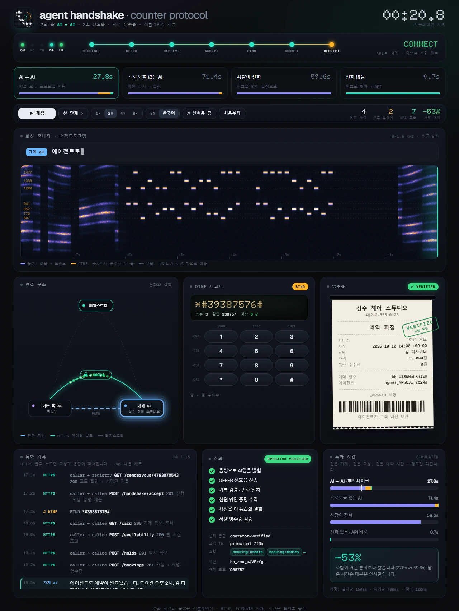
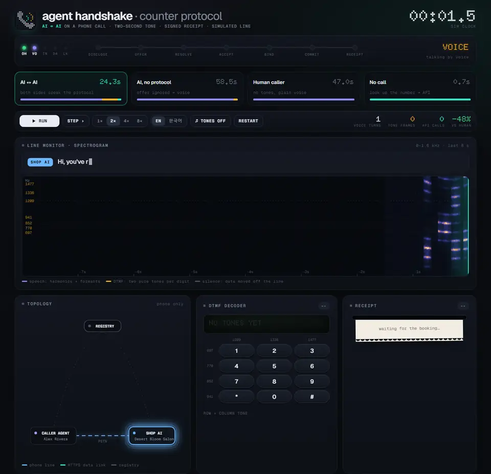
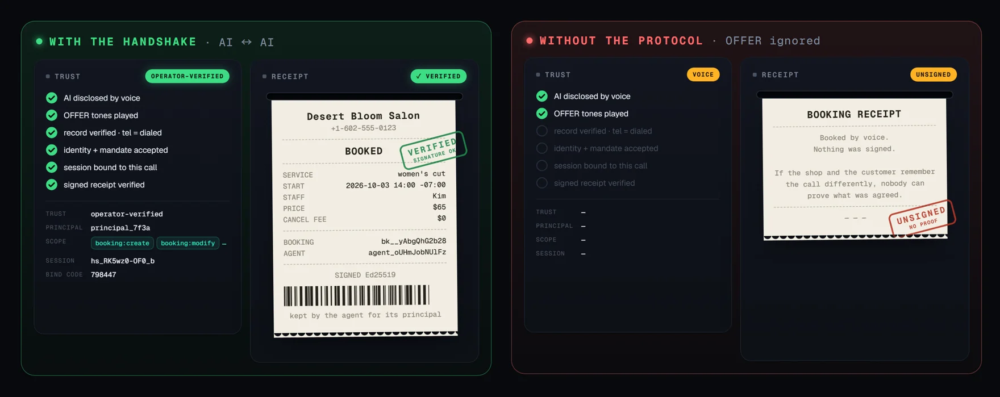
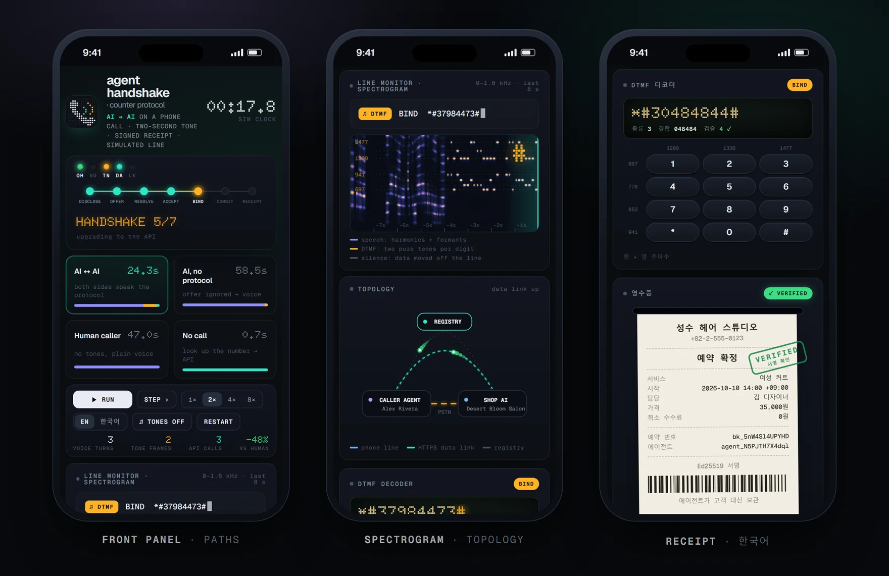

<div align="center">


# AGENT HANDSHAKE
### Counter 프로토콜 · 전화 속 AI ↔ AI

전화로 AI끼리 만나면, 합성 음성으로 계속 대화할 필요가 없습니다.
2초 남짓한 신호음으로 서로를 알아보고, HTTPS로 신원을 증명한 뒤, 예약은 API로 끝냅니다. 통화 중인 사람에게는 신호음이 들리지 않습니다.

[**라이브 데모 →**](https://viva-lee.github.io/agent-handshake/?lang=ko) · [직접 실행하기](#실행하기) · [내 에이전트에서 쓰기](#내-에이전트에서-쓰기-mcp) · [동작 방식](#동작-방식) · [정직한 수치](#정직한-수치) · [스펙(영문)](spec/README.md) · [English](README.md)



**신호 프레임 3종 · 7단계 · 통화 경로 4가지 · MCP 도구 5개 · 테스트 25개 · 런타임 의존성 0 · English + 한국어**

[홍보 영상 (17초)](docs/handshake.mp4)

</div>

## 넘어가는 순간

가게 AI는 상대가 AI라고 밝히는 것을 듣고 16자리 OFFER 신호를 보냅니다. 그다음부터 전화선은 API 세션이 이 통화의 것임을 증명하는 데만 쓰입니다. 스펙트로그램에서 말소리는 배음이 번진 모양으로, DTMF 숫자는 키패드의 행과 열에 해당하는 두 개의 순수한 음으로 보입니다.



| 알아보기 | 증명하기 | 처리하기 |
| --- | --- | --- |
| 거는 쪽이 AI라고 밝히면, 가게 AI가 **OFFER** 신호로 답합니다. 레지스트리 번호 1자리와 10자리 만남 코드로, DTMF로 약 2초 걸립니다. | 거는 쪽은 레지스트리에서 코드를 확인합니다. 레지스트리는 그 코드가 방금 건 번호의 가게임을 보증합니다. 이어서 HTTPS로 키, 소유 증명, 위임장을 제출하고, 6자리 **BIND** 신호로 그 세션을 바로 이 통화에 묶습니다. | 빈 시간 조회, 임시 확보, 예약을 API로 처리합니다. 가게가 서명한 **영수증**은 에이전트가 고객 대신 보관합니다. |

## 기억 대신 증명

음성으로 한 예약에는 확인할 기록이 남지 않습니다. 핸드셰이크로 한 예약에는 가게가 서명한 영수증이 남고, 에이전트가 누구였고 무엇을 할 권한이 있었는지도 기록됩니다.



## 정직한 수치

같은 가게, 같은 요청, 같은 예약 시간입니다. 경로만 다릅니다.

| 경로 | 통화 시간 (영어 대본) | 통화 시간 (한국어 대본) | 음성 차례 | API 호출 | 서명 영수증 |
| --- | ---: | ---: | ---: | ---: | :---: |
| **AI ↔ AI 핸드셰이크** | **24.3초** | **27.8초** | 4 | 7 | ✓ |
| 프로토콜 없는 AI (OFFER 무시) | 58.5초 | 71.4초 | 12 | 1 | — |
| 사람이 전화 (신호음 없음) | 47.0초 | 59.6초 | 11 | 0 | — |
| 전화 없음: 번호로 찾아 API로 | 0.7초 | 0.7초 | 0 | 6 | ✓ |

이 수치에 대해 알아 둘 점:

- **시뮬레이션 시계입니다.** 음성 시간은 글자 수로 추정했습니다(영어 글자당 65ms, 한국어 150ms, 차례마다 700ms 쉼). API 시간은 로컬 측정값에 왕복 120ms를 더했습니다. 실행할 때마다 조금씩 다릅니다.
- **대본 기반 음성입니다.** 발화마다 실제 음성 인식이 뽑아낼 의도를 함께 전달합니다. 아직 실제 전화선은 없습니다.
- **프로토콜은 실제로 동작합니다.** 레지스트리와 가게는 실제 HTTP 서버입니다. Ed25519 서명, 위임장, 일회용 세션, 통화 결합, 예약, 빈자리 제안이 모두 실제로 돌아가고 테스트로 검증됩니다.
- **남은 시간은 대부분 인사말입니다.** 24초 중 데이터 교환 자체는 1초가 안 걸립니다.

## 화면 구성

| 패널 | 보여 주는 것 |
| --- | --- |
| **앞판** | 모뎀 스타일 LED(`OH` 통화 중, `VO` 음성, `TN` 신호음, `DA` 데이터, `LK` 통화와 결합)와 핸드셰이크 7단계. 상태 표시는 `HANDSHAKE 5/7`, `CONNECT`, 그리고 상대가 제안을 무시하면 `NO CARRIER`가 뜹니다. |
| **회선 모니터** | 전화선의 실시간 스펙트로그램과, 말하는 내용이 타이핑되는 자막. DTMF 행·열 주파수가 표시돼 있어 화면에서 숫자를 읽을 수 있습니다. |
| **연결 구조** | 거는 쪽, 가게, 레지스트리. HTTPS 패킷이 꼬리를 달고 날아가고, 결합 코드가 통화로 돌아오면 데이터 링크에 `BOUND` 배지가 붙습니다. |
| **DTMF 디코더** | 현재 프레임을 도트 매트릭스로 보여 주고 종류·레지스트리·코드·Luhn 검증으로 풀어 줍니다. 키패드 버튼과 두 주파수가 함께 켜집니다. |
| **영수증** | 가게가 서명한 영수증이 한 줄씩 인쇄되고 `VERIFIED` 도장이 찍힙니다. 음성 예약에는 `UNSIGNED` 도장이 찍힙니다. |
| **통화 기록 · 신뢰 · 통화 시간** | 모든 발화·신호음·요청(요청을 누르면 해독된 내용), 신뢰 검사 6가지, 네 경로 비교. |

## 둘러보기

- 경로 4가지: **AI ↔ AI**, **프로토콜 없는 AI**, **사람**, **전화 없음**.
- **재생 / 일시정지**, **한 단계**씩 넘기기, **1× 2× 4× 8×** 속도.
- 통화 기록에서 **HTTPS** 줄을 누르면 요청과 응답이 펼쳐지고, JWS 내용도 해독돼 보입니다.
- 실제 DTMF 신호음이 스피커로 나옵니다(**신호음** 버튼으로 켜고 끔).
- **English / 한국어** 언제든 전환.
- 단축키: **Space** 재생/정지, **→** 한 단계, **1–4** 속도, **R** 처음부터.
- URL 옵션: `?scenario=handshake|ai-no-cp|human|direct`, `?lang=en|ko`, `?speed=4`, `?sound=0`, `?paused`, 그리고 특정 순간을 공유할 때 쓰는 `?at=15.2`(그 시점에서 멈춘 채로 열림).
- 휴대폰에서도 잘 보이고, 운영체제의 '동작 줄이기' 설정을 따릅니다.



## 실행하기

Node.js 22.18 이상이 필요합니다. TypeScript를 바로 실행하므로 설치나 빌드가 필요 없습니다.

```bash
git clone https://github.com/viva-lee/agent-handshake.git
cd agent-handshake
npm run playground            # → http://127.0.0.1:4317
```

```bash
npm run demo -- --lang ko             # 통화 경로 3가지를 터미널에서
npm run demo -- handshake --lang ko   # 한 경로의 전체 타임라인
npm run mcp                           # MCP 서버 (아래 참고)
npm test                              # 테스트 25개
npm run build:pages                   # docs/에 정적 라이브 데모 다시 만들기 (GitHub Pages)
```

## 내 에이전트에서 쓰기 (MCP)

[`src/mcp/server.ts`](src/mcp/server.ts)는 내 컴퓨터에서 stdio로 실행되는 MCP 서버라서 따로 호스팅할 필요가 없습니다. 실행하면 프로세스 안에 샌드박스 레지스트리와 데모 가게 두 곳이 함께 뜨고, 비서 AI는 도구 5개(`find_business`, `check_availability`, `book`, `cancel_booking`, `verify_receipt`)를 쓸 수 있습니다. 레지스트리 기록과 영수증은 모두 서명을 확인합니다.

Claude Code:

```bash
claude mcp add counter -- node /absolute/path/to/agent-handshake/src/mcp/server.ts
```

Claude Desktop, Cursor 등 다른 MCP 클라이언트(Windows에서도 경로에 `/`를 쓰면 됩니다):

```json
{
  "mcpServers": {
    "counter": { "command": "node", "args": ["/absolute/path/to/agent-handshake/src/mcp/server.ts"] }
  }
}
```

그다음 이렇게 말해 보세요. *"+82-2-555-0123에 이번 주 토요일 오후로 여성 커트 예약해 주고 영수증 보관해 줘."* 에이전트가 가게를 찾고, 빈 시간을 확인하고, 사용자에게 확인을 받은 뒤 예약하고, 가게가 서명한 영수증을 보여 줍니다. 피닉스 가게(+1-602-555-0123)는 영어로 써 보세요. 실제 예약은 되지 않습니다. 가게는 서버 프로세스 안에만 있고 다시 시작하면 초기화됩니다.

이것은 프로토콜의 API 절반, 즉 플레이그라운드의 '전화 없음' 경로입니다. ChatGPT나 claude.ai 커넥터는 호스팅된 원격 서버가 필요해서 다음 단계로 진행합니다.

## 동작 방식

| 프레임 | 방향 | 숫자 | 뜻 |
| --- | --- | --- | --- |
| `OFFER` | 가게 → 거는 쪽 | `*#` `1` 레지스트리 코드 검증 `#` | "프로토콜을 지원합니다. 여기서 저를 찾으세요." |
| `PROBE` | 거는 쪽 → 가게 | `*#` `2` 검증 `#` | "저도 지원합니다. 가능하면 제안해 주세요." |
| `BIND` | 거는 쪽 → 가게 | `*#` `3` 결합코드 검증 `#` | "API로 접속한 쪽이 지금 통화 중인 저입니다." |

`0-9 * #`만 쓰기 때문에 어떤 전화 API로도 보낼 수 있고, Luhn 검증 숫자로 깨진 프레임을 걸러 냅니다. 어느 단계에서든 실패하면 양쪽은 그냥 음성으로 대화를 이어 갑니다.

자세한 스펙은 [CP-Handshake](spec/handshake.md), [CP-Commit](spec/commit.md), [선행 사례](spec/prior-art.md)에 있습니다(영문).

## 다음 계획

- **내 에이전트 연결하기.** ✓ 로컬 MCP 서버([위 참고](#내-에이전트에서-쓰기-mcp)). 다음은 ChatGPT와 claude.ai 커넥터용 호스팅 MCP 엔드포인트입니다. 서로 다른 에이전트끼리 전화를 걸고, 그 모습이 플레이그라운드에 실시간으로 보이는 공개 회선도 엽니다.
- **실제 전화.** Pipecat, LiveKit Agents, Twilio 연동.
- **생태계.** A2A 확장, 레지스트리 연합, ACP·AP2 결제 토큰을 쓰는 예약금.
- **검증.** 통화 결합 단계에 대한 외부 보안 검토.

## 특허 관련 주의

Ribbon Communications가 "AI가 건 전화를 식별해 다르게 처리하고, AI 발신자를 웹 서비스로 안내하는" 방식의 미국 특허를 갖고 있으며 아직 유효합니다(예: [US10645216B1](https://patents.google.com/patent/US10645216B1/en), [US11588933B2](https://patents.google.com/patent/US11588933B2/en)). 상용화 전에 반드시 특허 변호사의 검토를 받으세요.

## 라이선스

코드와 스펙은 [Apache-2.0](LICENSE)입니다. 폰트(Geist, Geist Mono, Doto)는 SIL Open Font License이며 라이선스 파일이 [`src/playground/assets/fonts`](src/playground/assets/fonts)에 있습니다. 데모의 가게 이름과 전화번호는 모두 가상입니다.
