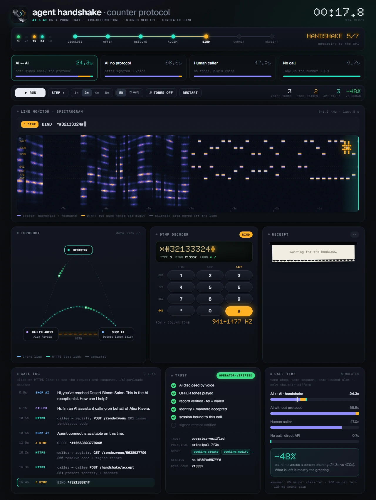
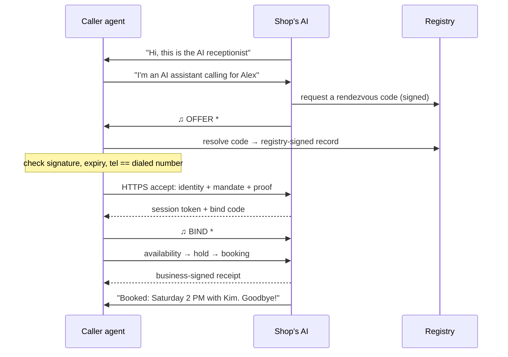

<div align="center">


# AGENT HANDSHAKE
### Counter Protocol · AI ↔ AI on a phone call

When two AIs meet on a phone call, they should not keep talking in synthesized speech.
They recognize each other with a two-second tone, prove who they are over HTTPS, and finish the booking through an API. People on the line never hear it.

[**Live demo →**](https://viva-lee.github.io/agent-handshake/) · [Run it locally](#run-locally) · [How it works](#how-it-works) · [Honest numbers](#honest-numbers) · [Spec](spec/README.md) · [한국어](README.ko.md)



**3 tone frames · 7 steps · 4 call paths · 24 tests · 0 runtime dependencies · English + 한국어**

[Promo video (17 s)](docs/handshake.mp4)

</div>

## Watch the handoff

The shop's AI hears a caller say it is an AI, plays a 16-digit OFFER frame, and from there the phone line is only used to prove that the API session belongs to this call. On the spectrogram, speech is a smear of harmonics; every DTMF digit is two pure tones, one row and one column of the keypad.


| Recognize | Prove | Commit |
| --- | --- | --- |
| The caller discloses it is an AI. The receptionist answers with an **OFFER** frame: a registry digit and a 10-digit rendezvous code, about 2 seconds of DTMF. | The caller resolves the code at a registry that vouches for the dialed number, then presents its key, a proof and a mandate over HTTPS. A 6-digit **BIND** frame ties that session to this exact call. | Availability, hold and booking happen over the API. The business signs a **receipt** that the agent keeps for the person it works for. |

## Proof instead of memory

A voice booking leaves nothing to check. A handshake booking leaves a business-signed receipt, plus a record of who the agent was and what it was allowed to do.


## Honest numbers

Same shop, same request, same booked slot. Only the path differs.

| Path | Call time, English script | Call time, Korean script | Voice turns | API calls | Signed receipt |
| --- | ---: | ---: | ---: | ---: | :---: |
| **AI ↔ AI with the handshake** | **24.3 s** | **27.8 s** | 4 | 7 | ✓ |
| AI without the protocol (OFFER ignored) | 58.5 s | 71.4 s | 12 | 1 | — |
| Human caller (no tones played) | 47.0 s | 59.6 s | 11 | 0 | — |
| No call: look up the number, use the API | 0.7 s | 0.7 s | 0 | 6 | ✓ |

What these numbers are and are not:

- **Simulated clock.** Speech time is estimated from text length (65 ms per character in English, 150 ms in Korean, plus a 700 ms pause per turn). API time is measured on localhost plus an assumed 120 ms round trip. Results vary slightly per run.
- **Scripted speech.** Each utterance carries the intent a real speech-recognition stack would extract. There is no real phone line yet.
- **Real protocol.** The registry and the shop are real HTTP servers. Ed25519 signatures, mandates, single-use sessions, channel binding, holds, bookings and waitlist offers all run for real, and are covered by tests.
- **Where the time goes.** Most of the remaining 24 seconds is the greeting and the AI disclosure. The data exchange itself takes under a second.

## What you are looking at

| Panel | Shows |
| --- | --- |
| **Front panel** | Modem-style LEDs (`OH` off hook, `VO` voice, `TN` tones, `DA` data, `LK` locked to the call) and the 7 handshake steps. The status reads `HANDSHAKE 5/7`, `CONNECT`, or `NO CARRIER` when the caller ignores the offer. |
| **Line monitor** | A live spectrogram of the phone line with a typed caption of what is being said. DTMF row and column frequencies are marked, so you can read the digits off the screen. |
| **Topology** | Caller, shop and registry. HTTPS packets fly with trails; the data link locks with a `BOUND` badge once the bind code comes back over the call. |
| **DTMF decoder** | The current frame on a dot-matrix display, decoded into type, registry, code and Luhn check, with the keypad key and its two frequencies lighting up. |
| **Receipt** | The business-signed receipt prints line by line and gets a `VERIFIED` stamp. Voice bookings get an `UNSIGNED` one. |
| **Call log · Trust · Call time** | Every utterance, tone and request (click a request to see decoded payloads), the six trust checks, and all four paths side by side. |

## Explore your way

- Four paths: **AI ↔ AI**, **AI without the protocol**, **human caller**, **no call**.
- **Run / Pause**, **Step** to the next event, and **1× 2× 4× 8×** speed.
- Real DTMF tones play through your speakers (toggle with **Tones**).
- **English and 한국어**, switchable at any time.
- Keyboard: **Space** run/pause, **→** step, **1–4** speed, **R** restart.
- URL options: `?scenario=handshake|ai-no-cp|human|direct`, `?lang=en|ko`, `?speed=4`, `?sound=0`, `?paused`, and `?at=15.2` to open paused at a moment you want to share.
- Works on phones, and respects *reduce motion*.


## Run locally

Requires Node.js 22.18 or newer. TypeScript runs directly; there is nothing to install or build.

```bash
git clone https://github.com/viva-lee/agent-handshake.git
cd agent-handshake
npm run playground            # → http://127.0.0.1:4317
```

Other entry points:

```bash
npm run demo                          # the three call paths in the terminal
npm run demo -- handshake --lang ko   # one path with its full timeline, in Korean
npm test                              # 24 tests, node:test, no dependencies
npm install && npm run typecheck      # optional strict TypeScript check
npm run build:pages                   # rebuild the static live demo in docs/ (GitHub Pages)
```

## How it works



| Frame | Direction | Digits | Meaning |
| --- | --- | --- | --- |
| `OFFER` | shop → caller | `*#` `1` registry code check `#` | "I speak the protocol; here is where to find me." |
| `PROBE` | caller → shop | `*#` `2` check `#` | "I speak it too; offer if you can." |
| `BIND` | caller → shop | `*#` `3` bind-code check `#` | "The party on your API is the party on this call." |

Only `0-9 * #` are used, so any telephony API can send the frames, and a Luhn check digit drops corrupted ones. If anything fails at any step, both sides simply keep talking.

## The protocol

| Document | Covers |
| --- | --- |
| [CP-Handshake](spec/handshake.md) | Frames, when to offer, the 10-step flow, registry API, security considerations, patent notice |
| [CP-Commit](spec/commit.md) | Mandates and proofs, sessions, the business card, availability, holds, bookings, changes, waitlist offers, receipts, errors |
| [Prior art](spec/prior-art.md) | MCP, A2A, GibberLink, STIR/SHAKEN, Web Bot Auth, AP2, ACP and how Counter Protocol relates to each |

Counter Protocol sits on top of MCP and A2A rather than competing with them: it defines what an agent and a business say about commitments, and how two agents that meet on a phone line find each other.

## Repository layout

```
spec/               the protocol: handshake, commit, prior art
src/crypto/         Ed25519 compact JWS
src/protocol/       DTMF frames, wire types, time helpers
src/registry/       reference rendezvous registry
src/business/       reference shop endpoint (CP-Commit + the shop side of the handshake)
src/agents/         caller agent, AI receptionist, simulated call, dialog in English and Korean
src/demo/           fixtures and the scenario runner
src/playground/     the dashboard (one HTML file, bundled fonts, dot-matrix logo)
test/               node:test suites
docs/               images and the promo video used in this README
```

## Roadmap

- **Bring your own agent.** An MCP server so Claude, ChatGPT and other assistants can book a Counter shop directly, and an open phone-line endpoint so independent agents can call each other and show up live in the playground.
- **Real calls.** Adapters for Pipecat, LiveKit Agents and Twilio.
- **Ecosystem.** An A2A extension and Agent Card entry, registry federation, deposits bound to ACP or AP2 payment tokens.
- **Review.** An external security review of the channel-binding step.

## Patent notice

Ribbon Communications holds active US patents on identifying AI-originated calls and handling them differently, including directing AI callers to a web service, for example [US10645216B1](https://patents.google.com/patent/US10645216B1/en) and [US11588933B2](https://patents.google.com/patent/US11588933B2/en). Get legal advice before deploying this commercially. Nothing here is legal advice or a statement about patent coverage.

## License

Code and spec: [Apache-2.0](LICENSE). Fonts: Geist, Geist Mono and Doto under the SIL Open Font License, with license files in [`src/playground/assets/fonts`](src/playground/assets/fonts). Shop names and phone numbers in the demo are fictional.
