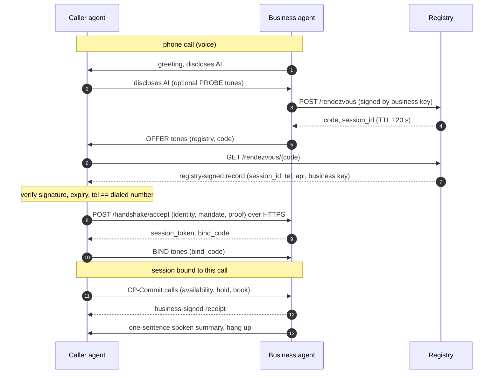

# CP-Handshake v0.1

**Status:** Draft, 2026-10-02. Experimental; not for production use.
**Part of:** [Counter Protocol](README.md). Companion: [CP-Commit](commit.md).

The key words MUST, MUST NOT, SHOULD, SHOULD NOT and MAY are to be interpreted as described in RFC 2119 and RFC 8174.

## 1. Purpose

Personal agents increasingly phone businesses, and businesses increasingly answer with AI receptionists. When both ends are machines, they still talk in synthesized speech: slow, error-prone, and paid for twice.

CP-Handshake lets the two agents on a call recognize each other within a few seconds, authenticate over the internet, bind that internet session to the phone call, and finish the task with [CP-Commit](commit.md). If either side does not support it, the call simply continues by voice. Nothing breaks, and people on the line do not hear handshake tones.

## 2. Roles and terms

| Term | Meaning |
| --- | --- |
| Caller agent (CA) | AI agent placing a phone call on behalf of a principal. |
| Business agent (BA) | AI answering the call on behalf of a business; operates the business's CP-Commit endpoint. |
| Registry (RG) | Service that issues rendezvous codes, verifies business phone numbers and signs records. |
| Principal | The person the caller agent acts for. Identified to businesses only by a pseudonymous id. |
| Operator | The company running the caller agent; signs mandates. |
| Rendezvous code | 10-digit, single-session, short-lived code carried in-band. |
| Bind code | 6-digit code returned over HTTPS and echoed in-band to prove the API party is on the call. |

## 3. In-band signals

Signals are DTMF digits on the voice channel. Only `0-9`, `*` and `#` are used, because many telephony APIs cannot generate `A-D`.

```
frame = "*#" type payload check "#"
check = Luhn mod-10 check digit computed over (type + payload)
```

| Type | Name | Direction | Payload | Length |
| --- | --- | --- | --- | --- |
| `1` | OFFER | BA → CA | registry id (1 digit) + rendezvous code (10 digits) | 16 symbols |
| `2` | PROBE | CA → BA | none | 5 symbols |
| `3` | BIND | CA → BA | bind code (6 digits) | 11 symbols |

- Tones SHOULD last at least 70 ms with gaps of at least 50 ms. The reference implementation uses 80 ms + 60 ms, so an OFFER takes about 2.2 s.
- Receivers MUST scan the digit stream for frames and MUST discard frames whose check digit fails or whose payload length is wrong.
- An out-of-band carrier (for example a SIP header on VoIP legs) MAY be used in addition, but implementations MUST support the in-band form because carriers often strip headers.

## 4. When to offer

A BA MUST NOT play an OFFER unless it has reason to believe the caller is an agent:

1. it received a PROBE, or
2. the caller disclosed that it is an AI, or
3. an out-of-band indicator says so.

A BA SHOULD say a short phrase before the tones (reference: "Agent connect is available on this line."). A CA that supports CP SHOULD disclose verbally that it is an AI acting for someone, and MAY send a PROBE right after.

## 5. Flow



1. The call connects. The BA greets and discloses that it is an AI.
2. The CA discloses that it is an AI. It MAY send a PROBE.
3. The BA requests a code: `POST {registry}/cp/v0.1/rendezvous` with a request JWS signed by the business key (§6).
4. The BA plays OFFER(registry id, code).
5. The CA resolves the code: `GET {registry}/cp/v0.1/rendezvous/{code}`.
6. The CA MUST verify the registry signature with the key it trusts for that registry id, the record's `exp`, and that the record's `tel` equals the number it dialed (E.164, digits only). If any check fails it MUST NOT send an accept and continues by voice.
7. The CA sends `POST {api}/handshake/accept` with `session_id`, its identity, a mandate and a proof ([CP-Commit §3](commit.md#3-credentials-and-sessions)). The BA verifies them and returns `session_token`, `bind_code` and `bind_deadline` (at most 15 s away).
8. The CA plays BIND(bind_code). The BA marks the session bound.
   - A BA MUST reject state-changing CP-Commit calls on an unbound handshake session with `403 not_bound`.
   - A BA MUST revoke the session after 3 wrong bind codes or when the deadline passes.
9. The CA completes the task with CP-Commit using the session token.
10. The BA SHOULD speak a one-sentence summary of the result so that the call recording reflects what happened. Either side MAY then hang up.

**Fallback.** The BA continues by voice if no accept arrives within 8 s of the OFFER, or if the caller keeps speaking. The CA continues by voice on any failure. Neither side drops the call because the handshake failed.

## 6. Registry API

All paths are under `{registry}/cp/v0.1`. Responses are JSON. Errors use the CP-Commit error format.

| Method and path | Who calls | Purpose |
| --- | --- | --- |
| `GET /registry` | anyone | `{registry_id, jwk}`: the registry's id digit and signing key |
| `POST /businesses` | business | Enroll `{business_id, tel, api, jwk}`. A production registry MUST verify control of `tel` (for example by a verification call) before serving records for it. |
| `POST /rendezvous` | BA | Body `{request}`: JWS `{business_id, iat}` signed by the enrolled business key. Returns `{registry_id, code, session_id, expires_at}`. |
| `GET /rendezvous/{code}` | CA | `{record}`: JWS of type `cp.rendezvous` (below). `404 unknown_code` if unknown or expired. |
| `GET /lookup?tel=` | any agent | `{record}`: JWS of type `cp.lookup` for discovery without a call. |
| `GET /operators/{id}` | BA | `{operator_id, jwk}`: the key an operator signs mandates with. |

```jsonc
// cp.rendezvous payload, signed by the registry
{
  "typ": "cp.rendezvous",
  "code": "4815162342",
  "session_id": "hs_…",
  "business_id": "seongsu-hair",
  "tel": "+8225550123",
  "api": "https://api.example/cp/v0.1",
  "business_jwk": { "kty": "OKP", "crv": "Ed25519", "x": "…", "kid": "…" },
  "iat": 1790940000,
  "exp": 1790940120
}
```

Registry ids are single digits so that they fit in an OFFER. `0` is reserved for local testing. How ids are allocated to independent registries is an open issue (§10).

## 7. Security considerations

1. **Business impersonation.** A rogue answerer could play someone else's OFFER. The CA's check that the record's `tel` equals the dialed number, together with the registry's verification of phone control, prevents this. Call forwarding to a different business is caught the same way.
2. **Code interception.** Anyone who hears the OFFER can resolve the code. A session accepts only one accept, and the BIND step proves that the accepting party is on the call: only it knows the bind code, and only the call carries it back. An eavesdropper who accepts first cannot bind and is revoked.
3. **Caller impersonation.** The accept carries a proof of possession of the agent key and a mandate bound to that key (`cnf.jkt`). Mandates signed by an operator key known to the registry are `operator-verified`; others are `self-asserted`. Businesses MAY apply stricter policy, such as deposits, to self-asserted agents.
4. **Downgrade.** Suppressing tones only causes a fallback to voice, which is the status quo.
5. **Replay.** Sessions are single-use, proofs carry `iat` within ±120 s, and records expire.
6. **Guessing codes.** The code space is 10^10, codes live 120 s, and registries SHOULD rate-limit resolution per client.
7. **Privacy.** OFFER frames carry no personal data. The registry learns that some agent is calling a business at a given time; it SHOULD keep minimal logs. The caller's identity is sent only to the business, never to the registry.
8. **Disclosure.** Both sides SHOULD disclose verbally that they are AI. Laws on AI disclosure and call recording differ by country; implementers must check them.

## 8. Human factors

Because of §4, a person who calls normally never hears tones. If a BA wrongly believes the caller is an agent, the person hears a short spoken phrase and about two seconds of tones, then the BA continues by voice.

## 9. Intellectual property notice

Ribbon Communications holds an active US patent family on identifying calls that originate from AI systems and handling them differently, including pointing AI callers to a web service: for example [US10645216B1](https://patents.google.com/patent/US10645216B1/en) and [US11588933B2](https://patents.google.com/patent/US11588933B2/en), priority date 2019-03-26. Implementers should get their own legal advice before deploying this protocol commercially. This draft makes no statement about whether any patent covers it.

## 10. Open issues

- Registry federation and allocation of registry id digits.
- A registered out-of-band SIP header and its interaction with STIR/SHAKEN attestation.
- An audible "chirp" alternative for lines that strip DTMF.
- Transfers and multi-party calls (SIP REFER).
- Formal analysis of the channel-binding step.
- Royalty-free licensing commitment for contributors.
